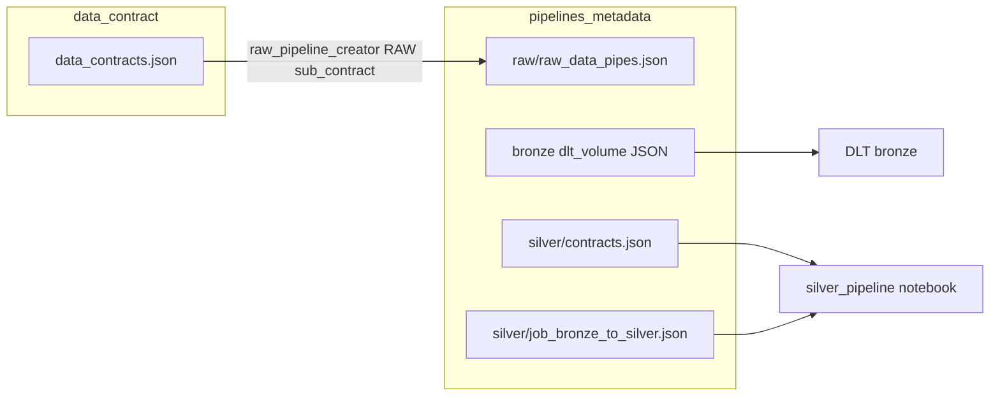

# Databricks Pipelines Skill

## When to Activate

Use this skill when:

- Creating or updating **pipeline metadata JSON** under `databricks/ingestion-pipelines/pipelines_metadata/`
- Explaining how **RAW**, **bronze**, and **silver** layers connect to notebooks and contracts
- Adding a new ingestion path end-to-end (and need to know which files to touch)

## Read First (do not skip)

1. [databricks/instructions/AGENT_INSTRUCTIONS.md](databricks/instructions/AGENT_INSTRUCTIONS.md) — allowed vs forbidden metadata fields, file locations, safety rules
2. [databricks/instructions/.cursorrules](databricks/instructions/.cursorrules) — patterns, glossary, golden bronze example

Domain-level contracts live in [data_contract/instructions/.cursorrules](data_contract/instructions/.cursorrules); for editing `data_contract/data_contracts.json`, use the **data-contract** skill.

## Architecture (high level)

| Layer | Role | Metadata | Runtime |
|-------|------|----------|---------|
| **RAW** | Scheduled job runs a RAW notebook; lands data to a Volume path | `pipelines_metadata/raw/raw_data_pipes.json` | [raw_pipeline_creator.py](databricks/ingestion-pipelines/pipelines_notebooks_templates/raw/raw_pipeline_creator.py) reads contracts, writes metadata, syncs Jobs API |
| **Bronze** | DLT ingests JSON from Volume → `bronze` catalog | `pipelines_metadata/bronze/databricks_volume/json/*.json` | DLT pipeline; notebook path fixed in `libraries.glob.include` |
| **Silver** | Watermark, map columns, dedupe, quality, merge into `silver` | `pipelines_metadata/silver/contracts.json` + optional `job_bronze_to_silver.json` | [silver_pipeline.py](databricks/ingestion-pipelines/pipelines_notebooks_templates/silver/silver_pipeline.py) loads contract by `contract_id` from `contracts.json` |

## Global rules for metadata

1. **Existing JSON is the schema** — find the closest file in `pipelines_metadata/`, copy structure, change only what the layer allows.
2. **Do not invent keys** or remove fields present in the template you copied.
3. **Do not edit** pipeline notebooks or under `pipelines_notebooks_templates/` unless the user or `AGENT_INSTRUCTIONS.md` explicitly allows it (exception: RAW orchestration may mention `raw_pipeline_creator.py` when explicitly requested).

---

## RAW layer

### What the agent must know

- RAW jobs are **driven by** `data_contract/data_contracts.json` entries that include `sub_contracts.raw`. The creator validates and builds job JSON.
- Required contract fields (for RAW generation): `_id`, `data_producer`, `sub_contracts.raw.parameters.schedule.databricks_quartz_cron`, `sub_contracts.raw.parameters.file_name`, `sub_contracts.raw.parameters.target_path`.
- `file_name` must match `^[a-zA-Z0-9_]+\.py$` and the notebook must exist under `databricks/ingestion-pipelines/pipelines_notebooks_templates/raw/` (stem = name without `.py`).
- **Naming:** job `name` = `raw_job_<notebook_stem>_<_id>`; `task_key` = `<notebook_stem>_<_id>`.
- `target_path` is normalized to end with `/`.

### Metadata file

- Path: `databricks/ingestion-pipelines/pipelines_metadata/raw/raw_data_pipes.json`
- **Shape:** array of job objects. Copy an existing entry’s keys and nesting; align `schedule.quartz_cron_expression`, `tasks[].notebook_task.notebook_path`, `base_parameters.target_path` with the contract and workspace paths.
- Prefer regenerating via the **raw_pipeline_creator** notebook workflow after updating the data contract, rather than hand-inventing new job fields.

---

## Bronze layer

### Allowed to change

- `name`
- `configuration.source_path`, `configuration.target_schema`, `configuration.target_table`, `configuration.description`
- `root_path`

### Must stay identical to the template

- `pipeline_type`, `libraries`, `continuous`, `development`, `photon`, `channel`, `catalog`, `serverless`
- `libraries.glob.include` (notebook path) — **do not change** without platform policy

### Naming and paths

- Pipeline name: `dlt_volume_to_json-bronze.<schema>.<table>` (example: `dlt_volume_to_json-bronze.dbo.customers`)
- Source path: `/Volumes/workspace/default/raw/<table>/`
- Root path: `/Workspace/Shared/rooth_path/bronze/<schema>/<table>`

### File location and naming

- Directory: `databricks/ingestion-pipelines/pipelines_metadata/bronze/databricks_volume/json/`
- New file: `dlt_volume_to_json_<table>.json`
- Reference template: `dlt_volume_to_json.json` in the same folder

---

## Silver layer

### `contracts.json`

- Path: `databricks/ingestion-pipelines/pipelines_metadata/silver/contracts.json`
- Top-level object has **`contract_list`** (array). Each item includes at least: `contract_id`, `data_producer`, `data_consumers`, `parameters`.
- **`parameters`** includes: `source` / `destination` (`catalog`, `schema`, `table`), `pk_columns`, `watermark_column`, `ordering_column`, `column_mapping`, optional `schedule` (`databricks_quartz_cron`), `quality_procedures`.
- **Append** new contracts to `contract_list`. **Do not** replace the whole file or unrelated entries.
- `contract_id` is a string passed to the silver job as `data_contract_id`; it must match `get_data_contract` lookup in [general_helpers.py](databricks/ingestion-pipelines/pipelines_notebooks_templates/helpers/general_helpers.py).

### Column mapping and types

- Each mapping object should include: `source_column`, `destination_column`, `nullable`, `type`.
- Allowed `type` values must match keys in `TYPE_MAPPING` in [general_helpers.py](databricks/ingestion-pipelines/pipelines_notebooks_templates/helpers/general_helpers.py): `string`, `boolean`, `byte`, `short`, `int`, `bigint`, `float`, `double`, `date`, `timestamp`, `binary`.
- **Cast flag:** [silver_pipeline.py](databricks/ingestion-pipelines/pipelines_notebooks_templates/silver/silver_pipeline.py) uses `m.get("cast", True)` to decide whether to cast. Prefer the key **`cast`** (boolean) to match runtime code. If you see `force_cast` in older JSON, verify against `silver_pipeline.py` — the notebook does not read `force_cast`.

### `job_bronze_to_silver.json`

- Path: `databricks/ingestion-pipelines/pipelines_metadata/silver/job_bronze_to_silver.json`
- Array of job definitions. Notebook task `base_parameters` typically: `source_table` (e.g. `bronze.dbo.table`), `destination_table` (e.g. `silver.dbo.table`), `data_contract_id` (must exist in `contract_list`).
- Copy the structure of an existing job when adding a new one.

---

## Workflow checklist (new pipeline)

1. Confirm requirements in [AGENT_INSTRUCTIONS.md](databricks/instructions/AGENT_INSTRUCTIONS.md).
2. Update or add **data contract** entries in `data_contract/data_contracts.json` (see data-contract skill) so RAW/bronze/silver parameters align.
3. **RAW:** ensure notebook exists under `templates/raw/`; run creator / update `raw_data_pipes.json` consistently with existing jobs.
4. **Bronze:** add `dlt_volume_to_json_<table>.json` under `bronze/databricks_volume/json/`, copying `dlt_volume_to_json.json`, changing only allowed fields.
5. **Silver:** append to `contract_list` in `contracts.json`; add or update `job_bronze_to_silver.json` if a new scheduled silver job is needed.

---

## Glossary (this repo)

| Term | Meaning |
|------|---------|
| **DLT** | Delta Live Tables; bronze configs target DLT pipelines |
| **pipeline_type** | e.g. `WORKSPACE` — do not change for bronze template |
| **root_path** | Workspace folder for pipeline deployment artifacts |
| **contract_list** | Silver metadata: list of silver transformation contracts |
| **column_mapping** | Bronze column → silver column, type, nullability, optional `cast` |
